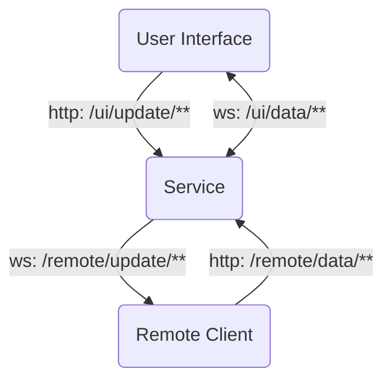

# Communication Channels and Protocol

## Channels



## Channel: `/ui/update/**`

The channel `/ui/update/**` is a HTTP request connection from the user interface to the service. Using this channel, the user interface is posting updates like volume change, playing item or current playback position.

### `/ui/update/now-playing-item-did-change`

**HTTP Method:** `POST`

**Payload:**

```json
{
    name: string;
    artistName: string;
    durationInMillis: number;
    artworkUrl: string;
}
```

**HTTP Status (success):** `204 No Content`

### `/ui/update/playback-progress-did-change`

**HTTP Method:** `POST`

**Payload:**

```json
{
    name: string;
    artistName: string;
    durationInMillis: number;
    artworkUrl: string;
    progress: number;
}
```

`progress` is `float` with `0 <= progress <= 1`

**HTTP Status (success):** `204 No Content`

### `/ui/update/shuffle-mode-did-change`

**HTTP Method:** `POST`

**Payload:**

```json
{
    shuffling: boolean;
}
```

**HTTP Status (success):** `204 No Content`

### `/ui/update/repeat-mode-did-change`

**HTTP Method:** `POST`

**Payload:**

```json
{
    repeating: boolean;
}
```

**HTTP Status (success):** `204 No Content`

### `/ui/update/playback-state-did-change'

**HTTP Method:** `POST`

**Payload:**

```json
{
    playing: boolean;
}
```

**HTTP Status (success):** `204 No Content`
